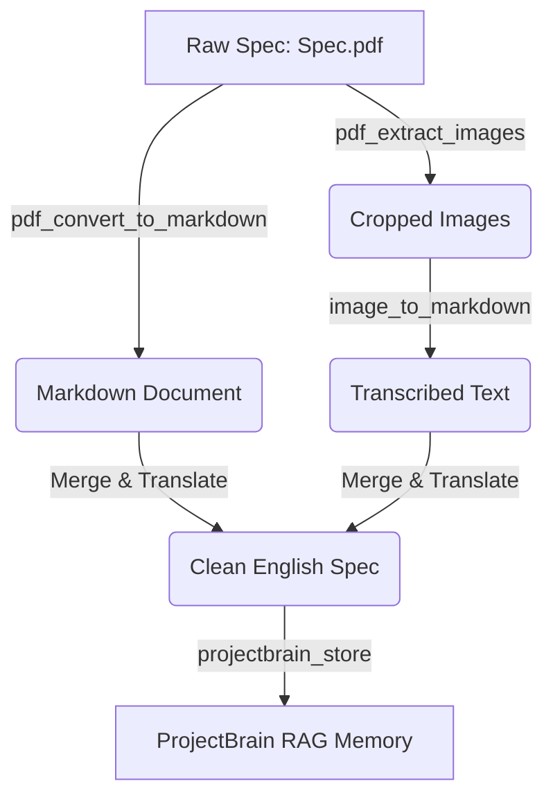
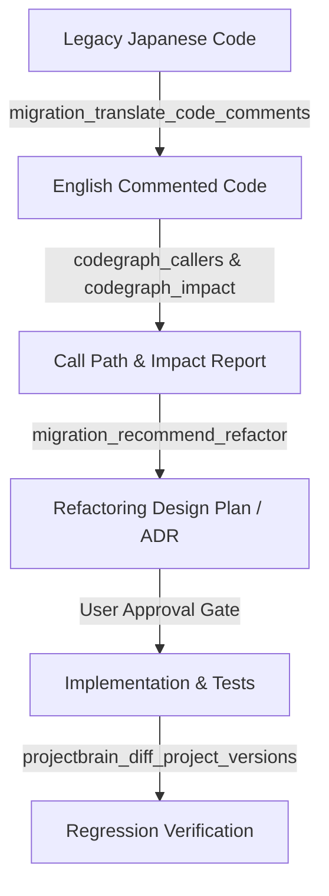

# Unified MCP Workflows & Tool Integration Skill

This skill defines the directory, rules, and optimal integration flows for all Model Context Protocol (MCP) servers in ProjectBrain. It enables AI agents to coordinate document parsing, visual OCR, AST structural mapping, semantic memory retrieval, and legacy code migration in a unified pipeline.

---

## 🧩 1. The MCP Tool Directory

ProjectBrain is powered by 5 specialized MCP servers. Below is the reference map of which tools to use for each task:

| MCP Server | Key Tools | Primary Purpose |
| :--- | :--- | :--- |
| **Document Ingestion** | `pdf_convert_to_markdown`, `excel_convert_to_markdown`, `docx_extract_text`, `pptx_to_markdown` | Ingests specifications, design documents, and spreadsheets into structured Markdown. |
| **Visual OCR** | `image_to_markdown` (under `image-to-markdown-mcp`) | Transcribes diagrams, flowcharts, or embedded PDF/PPTX images into markdown text. |
| **CodeGraph** | `codegraph_search`, `codegraph_context`, `codegraph_trace`, `codegraph_callers`, `codegraph_explore` | Tree-sitter AST index of source code. Traces calls, finds definitions, and explores symbol bodies. |
| **ProjectBrain** | `projectbrain_query`, `projectbrain_store`, `projectbrain_sync_codegraph`, `projectbrain_diff_project_versions` | Long-term semantic memory (RAG) and cross-version/cross-branch symbol comparison. |
| **Migration Helper** | `migration_translate_code_comments`, `migration_recommend_refactor`, `migration_batch_scan_logic` | Automates comment translation (e.g. Japanese ⇄ English) and designs modern architectural equivalents. |

---

## 🔄 2. Core Integrated Flows (Step-by-Step)

### Flow A: Ingesting Complex Japanese Design Specifications (Docs ➔ OCR ➔ RAG)
Use this flow when the user provides Japanese design specs (PDF/PPTX/Excel) with embedded images or tables and wants the AI to understand the requirements.



1. **Convert Document**: Call `pdf_convert_to_markdown` (or `pptx_to_markdown`) on the target file.
2. **Extract & OCR Diagram Images**:
   * If there are diagram/flowchart images, use `pdf_extract_images` to crop them.
   * Send the cropped image paths to `image_to_markdown` to transcribe them into clear markdown text.
3. **Synthesize & Store**: Merge the document markdown and OCR transcriptions. Translate any Japanese specifications to English, and call `projectbrain_store` (scoped to `<project_id>:<branch>`) to save the specification into the semantic RAG database.

---

### Flow B: Local-to-Remote Codebase Synchronization (AST ➔ Graph ➔ Server)
Use this flow when a local project needs to be indexed and pushed to a remote ProjectBrain server (e.g. `http://5.104.85.38:8080`).

> [!IMPORTANT]
> A remote MCP server running via SSE cannot access your local workspace. You must run the synchronization locally on your machine.

1. **Verify Local CLI**: Ensure you have Python and Node (for codegraph tree-sitter CLI) installed locally.
2. **Run Sync Command Cursors/Terminal**:
   Execute the `codegraph-sync` command in your local workspace:
   ```bash
   python -m projectbrain.main codegraph-sync <project_id> <remote_server_url> <local_project_path> --sync-memories
   ```
   * *What happens*: This command initializes CodeGraph locally (`.codegraph/codegraph.db`), parses all symbols (classes, methods, relationships), walks the codebase files, and POSTs both the symbol graph and the codebase files to the remote server.
3. **Verify Upload**: Access the web dashboard on the server (`http://<remote-ip>:8080/dashboard/`) or run `projectbrain_query` in Claude/Cursor to ensure the project memories are populated.

---

### Flow C: End-to-End Legacy Codebase Refactoring (Japanese Struts/WebForms ➔ FastAPI/React)
Use this flow to migrate or refactor a legacy module.



1. **Translate Comments**: Call `migration_translate_code_comments(direction="ja2en")` on the source files to convert comments to English without modifying code logic.
2. **Build Call Trees**: Run `codegraph_callers` and `codegraph_impact` on the legacy class/method to trace all references and dependencies.
3. **Formulate Refactoring Plan (ADR)**:
   * Call `migration_recommend_refactor` to generate structural mapping blueprints.
   * Write an Architecture Decision Record (ADR) file.
   * **STOP AND WAIT FOR USER APPROVAL**: Present the ADR to the user. Do not write any code until the user approves the plan.
4. **Implement incrementally**: Implement the modern equivalents (e.g., FastAPI controllers, SQLAlchemy models, React components). Keep variables and business constraints aligned with the legacy code.
5. **Verify Version Diff**: Once implemented, run `projectbrain_diff_project_versions` comparing the base branch and your refactored branch to check structural symbol changes and ensure no regressions occurred.

---

## 💡 3. Best Practices & Optimization

*   **Avoid Raw Grep**: Always query `codegraph_search` or `codegraph_context` first. Tree-sitter parsing is semantic and much faster than text matching.
*   **Token Conservation**: Use `codegraph_explore` to read multiple symbols' source code in a single call instead of making many individual `codegraph_node` calls.
*   **Keep RAG namespaces clean**: Always append branch names to project IDs when storing memories (e.g. `e-commerce-portal:main` vs `e-commerce-portal:refactor-login`). This allows the AI to compare versions accurately.
