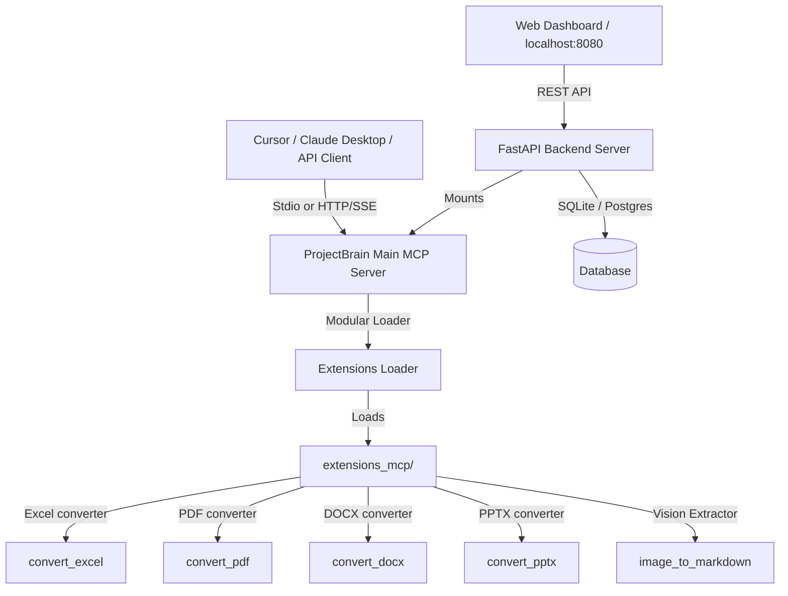

# ProjectBrain 🧠

> **Project-Centric Cognitive Engine, Codebase Version Diff Control Panel, and Modular MCP Extensions Framework.**
>
> A self-hosted engine supporting SQLite & PostgreSQL, featuring built-in Model Context Protocol (MCP) servers, a premium glassmorphic web dashboard, and a plug-and-play Custom MCP Extensions architecture.

---

## 🚀 Key Features

*   **📁 Project-Centric Memory Partitioning**: Automatically partitions all cognitive memories, temporal facts, semantic searches, and document generation statistics by the active project (e.g. `ecommerce-app:main` vs `ecommerce-app:feature-checkout`).
*   **📊 Codebase Structure Graph (Codegraph)**: Synchronizes local symbol trees (classes, methods, functions, files, and relationships) to visualize the architecture dynamically using Vis.js.
*   **🔄 Unified Codebase & Memory Version Diffing**: Compare different branches or versions of a project to inspect:
    *   **Structural Code Changes**: Added, deleted, and modified code symbols (with changes in signatures, docstrings, or line ranges).
    *   **Cognitive Memory Changes**: Context memories, guidelines, or business requirements unique to each version.
*   **🧩 Modular MCP Extensions Framework (`extensions_mcp/`)**:
    *   Plug-and-play architecture where subdirectories (e.g. `image_to_markdown`, `convert_pdf`, etc.) are dynamically detected, loaded, and registered to the main MCP server.
    *   Supports local **Stdio transport** and remote **HTTP/SSE transport** mounted directly to the FastAPI server.
*   **📁 Local Document Parsing & Ingestion**: Upload PDF, Word (`.docx`), Excel (`.xlsx`), and Text/Markdown files directly via the dashboard. Files are parsed locally to clean Markdown and ingested into the active project's RAG index.
*   **🤖 Gemini PM Documentation Copilot**: Compiles project memories, structural diffs, and developer guidelines into Product Requirement Documents (PRDs), Roadmaps, or Status Reports.

---

## 🧱 Architecture Overview



---

## 🛠️ Installation & Setup

### 1. Prerequisite Packages
Install Python packages and standard CLI dependencies:
```bash
pip3 install -e .
```

### 2. Environment Variables (`.env`)
Create a `.env` file in the root directory:
```dotenv
# API Keys
GEMINI_API_KEY=your_gemini_api_key_here
LLM_API_KEY=your_gemini_api_key_here

# Database Configurations
OM_METADATA_BACKEND=sqlite # Or postgres
OM_DB_PATH=projectbrain.db # Scoped to workspace directory

# Optional remote PostgreSQL
# OM_PG_HOST=localhost
# OM_PG_PORT=5432
# OM_PG_USER=postgres
# OM_PG_PASSWORD=secret
# OM_PG_DB=projectbrain
```

---

## 🏃 Running the Application

### Start the REST API & Web Dashboard
The backend serves the web client, mounted HTTP/SSE endpoints, and RAG routes:
```bash
python3 -m projectbrain.main serve
```
*   **Web Dashboard**: Open 👉 [http://localhost:8080/dashboard/](http://localhost:8080/dashboard/)

### Start the Local Stdio MCP Server
Configure your local AI editor (e.g. Cursor or Claude Desktop) to run:
```bash
python3 -m projectbrain.main mcp
```

---

## 🔄 Indexing & Diffing Codebase Versions

### 1. Synchronizing Codebase Structure
Index your repository structure using the `codegraph` CLI and synchronize it to the ProjectBrain database:

```bash
# 1. Run tree-sitter indexing in your codebase directory
codegraph init

# 2. Sync nodes & edges to ProjectBrain under a specific project name and branch
python3 -m projectbrain.main codegraph-sync ecommerce-app:main http://localhost:8080
```

### 2. Comparing Versions
Select your **Base Version** (e.g. `ecommerce-app:main`) and **Target Version** (e.g. `ecommerce-app:feature-checkout`) on the dashboard's **Version Compare** tab, or call the MCP tool `projectbrain_diff_project_versions`.

---

## 🧩 Custom MCP Extensions Framework

You can create and add custom MCP extensions by placing folders inside the `extensions_mcp/` directory.

### Extension Standard Directory Structure
Each extension is structured as a self-contained Python package:
```
extensions_mcp/
└── my_custom_extension/
    ├── extension.json         # Manifest file declaring metadata
    ├── __init__.py            # Empty initialization file
    ├── server.py              # Entrypoint exposing 'mcp' FastMCP instance
    └── client.py              # HTTP client helper
```

### Example Manifest (`extension.json`)
```json
{
  "name": "my-custom-extension",
  "version": "1.0.0",
  "description": "Calculates mathematics formulas.",
  "entrypoint": "server.py",
  "env_vars": [],
  "dependencies": ["numpy"]
}
```

### Example Server Entrypoint (`server.py`)
```python
from mcp.server.fastmcp import FastMCP

# Must define FastMCP server variable named 'mcp'
mcp = FastMCP("my-custom-extension")

@mcp.tool(name="calc_add")
async def calc_add(x: int, y: int) -> int:
    """Adds two integers."""
    return x + y
```

### Remote Invocation (HTTP Client Example)
Each extension contains a `client.py` script to invoke tools remotely via the Streamable HTTP JSON-RPC endpoint:
```bash
# Invoke pdf page count tool remotely
python3 extensions_mcp/convert_pdf/client.py pdf_get_page_count '{"file_path": "manual.pdf"}' --url http://localhost:8080
```

---

## ⚡ MCP Tool Reference

ProjectBrain registers the following tools automatically:

### Core Tools
*   **`projectbrain_query`**: Search contextual memories or temporal facts.
    *   *Args*: `query` (str), `type` (`"contextual"`, `"factual"`, `"unified"`), `user_id` (project ID).
*   **`projectbrain_store`**: Store a new memory or fact.
    *   *Args*: `content` (str), `type` (`"contextual"`, `"factual"`, `"both"`), `user_id` (project ID), `tags` (list).
*   **`projectbrain_sync_codegraph`**: Run tree-sitter sync for a local workspace path.
*   **`projectbrain_diff_project_versions`**: Generate a markdown report comparing codebase symbols and memories.

### Converter Extensions Tools
*   **`img2md_extract_folder`**: Extract OCR markdown text from a folder of images.
*   **`excel_list_sheets`**: List sheets inside Excel/CSV files.
*   **`excel_convert_to_markdown`**: Convert Excel/CSV files into markdown tables.
*   **`docx_extract_text`**: Extract text from a Word document.
*   **`pdf_convert_to_markdown`**: Extract text and tables from PDF files to markdown.
*   **`pptx_to_markdown`**: Convert PowerPoint presentation slides to markdown documents.
