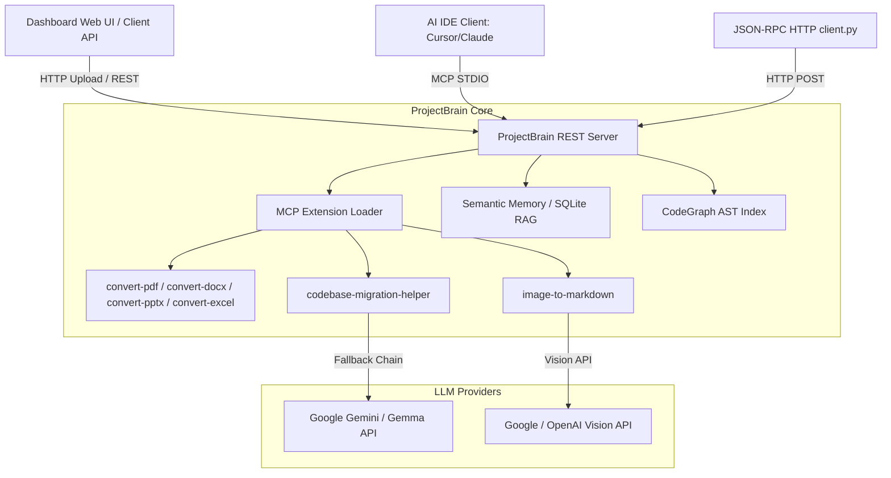

# ProjectBrain System Documentation - Comprehensive Technical Reference

Welcome to the comprehensive technical documentation for **ProjectBrain**, a production-grade legacy codebase refactoring, migration, and semantic memory RAG system.

> [!NOTE]
> This guide is verified against the live codebase and serves as the single source of truth for all tools, APIs, dashboard workflows, STDIO plugins, and HTTP client scripts.

---

## Table of Contents
1. [System Architecture Overview](#1-system-architecture-overview)
2. [Core Modules & Processing Pipelines](#2-core-modules--processing-pipelines)
   - [2.1 Unified Document Parsing & OCR Pipeline](#21-unified-document-parsing--ocr-pipeline)
   - [2.2 RAG Semantic Memory System](#22-rag-semantic-memory-system)
   - [2.3 Legacy Codebase Migration & Business Scanning](#23-legacy-codebase-migration--business-scanning)
3. [MCP Tool Directory](#3-mcp-tool-directory)
   - [3.1 Document Conversion Tools](#31-document-conversion-tools)
   - [3.2 Codebase Migration Helper Tools](#32-codebase-migration-helper-tools)
   - [3.3 CodeGraph AST Analysis Tools](#33-codegraph-ast-analysis-tools)
4. [Access Workflows & Guides](#4-access-workflows--guides)
   - [4.1 Dashboard Web User Interface](#41-dashboard-web-user-interface)
   - [4.2 MCP STDIO Transport (IDE Integration)](#42-mcp-stdio-transport-ide-integration)
   - [4.3 MCP Streamable HTTP Client JSON-RPC](#43-mcp-streamable-http-client-json-rpc)
   - [4.4 Standalone Command Line Interface (CLI)](#44-standalone-command-line-interface-cli)
5. [Reliability & Fallbacks (Failure Tolerant Models)](#5-reliability--fallbacks-failure-tolerant-models)

---

## 1. System Architecture Overview

ProjectBrain is designed around an **extensible, agent-driven model**. The system integrates semantic search (RAG) and AST structural analysis to assist engineers in maintaining and refactoring complex software systems (specifically legacy systems containing Japanese specifications/comments).



---

## 2. Core Modules & Processing Pipelines

### 2.1 Unified Document Parsing & OCR Pipeline
ProjectBrain uses an asynchronous parsing pipeline that unifies file ingestion from both the Dashboard Web UI and individual MCP command-line tools.

- **Supported File Formats**: `.pdf`, `.docx`, `.xlsx`, `.xls`, `.pptx`, `.txt`, `.md`, `.json`, `.yml`, `.yaml`, `.ini`, `.conf`.
- **Table Normalization**: Excel and PDF tables are automatically converted to clean, pipe-delimited GitHub-Flavored Markdown tables.
- **Embedded Image Extraction & OCR**:
  - **PDF files**: Uses `pdfplumber` to identify image bounding boxes on pages. The image regions are cropped out, exported in-memory as PNG bytes, and sent to the vision OCR client for transcription.
  - **PPTX files**: Traverses shapes to find embedded pictures, extracts raw image blobs and MIME types (`shape.image.blob`, `shape.image.content_type`), and transcribes them.
  - **OCR Fallback**: If the Vision API key is missing or rate-limited, the system falls back to standard `![Image]` placeholders without interrupting document parsing.

---

### 2.2 RAG Semantic Memory System
ProjectBrain integrates semantic vector storage with an SQLite database backend.

- **Workspace/Branch Wildcards**: Enables scoping searches, stats, and histories across branches using a SQLite `LIKE` wildcard character (`%`).
  - *Example*: Searching under `test-project:main` returns main branch memories. Searching under `test-project:%` searches across all branches of `test-project`.
- **Deduplication**: Newly added memories are automatically checked against existing entries to prevent redundant duplicates.
- **Memory Diffing**: Computes semantic differences between workspace snapshots to track codebase changes over time.

---

### 2.3 Legacy Codebase Migration & Business Scanning
To automate Japanese codebase translation and logic refactoring, the system exposes two primary tools:
1. **Comment Translation**: Scans source files to translate Japanese comments/docstrings to English (or vice versa) while keeping logic intact.
2. **Refactoring Recommendation**: Evaluates legacy modules (e.g. Struts controllers, ASP.NET WebForms) and designs modern Spring Boot, FastAPI, or React equivalent classes.
3. **Incremental Migration Planning**:
   - **Batch Scanning**: Recursively parses target projects, extracts each function's body, generates semantic business logic drafts using LLMs, and outputs a JSON draft manifest (`.planning/business_logic_drafts.json`).
   - **Phase Partitioning**: Group target functions into sequential refactoring phases (`.planning/migration_phases.json` and `.planning/migration_phases.md`) ordered by complexity and dependencies (e.g. helpers first, database layers second, controllers last).

---

## 3. MCP Tool Directory

### 3.1 Document Conversion Tools

| Tool Name | Input Parameters | Description | Fallback Action |
| :--- | :--- | :--- | :--- |
| `pdf_convert_to_markdown` | `file_path` (str) | Converts a PDF file to a Markdown document including tables and OCR-transcribed images. | Falls back to `pypdf` text extraction and standard `![Image]` placeholders. |
| `pdf_extract_text` | `file_path` (str) | Extracts text from all pages and returns a JSON payload. | Return error string. |
| `pdf_extract_tables` | `file_path` (str) | Extracts tables from all pages and returns a JSON payload. | Return error string. |
| `pdf_extract_images` | `file_path` (str), `output_dir` (str) | Crops all images and saves them to a target folder. | Returns empty list. |
| `pdf_get_page_count` | `file_path` (str) | Returns the total number of pages in the PDF. | Returns 0 / error. |
| `pdf_extract_page_text` | `file_path` (str), `page_number` (int) | Extracts text from a specific 1-based page. | Return error. |
| `docx_extract_text` | `file_path` (str) | Extracts all paragraphs text from a DOCX file. | Return error. |
| `docx_extract_tables` | `file_path` (str) | Extracts all tables in JSON array formats. | Return error. |
| `docx_create_document` | `file_path` (str), `content` (str) | Generates a new DOCX file with initial content text. | Return error. |
| `excel_list_sheets` | `file_path` (str) | Lists all sheets in an Excel or CSV file. | Return error. |
| `excel_convert_to_markdown` | `file_path` (str), `sheets` (list[str]) | Converts sheets to Markdown tables. | Return error. |
| `excel_convert_sheet_to_markdown` | `file_path` (str), `sheet_name` (str), `row_offset` (int), `row_limit` (int) | Converts a sheet to Markdown with pagination metadata. | Return error. |
| `markdown_convert_to_excel` | `markdown_content` (str), `output_file_path` (str) | Reconstructs an Excel workbook from Markdown tables. | Return error. |
| `pptx_to_markdown` | `file_path` (str) | Converts a PPTX presentation to Markdown (with slide titles, lists, and OCR images). | Falls back to standard bullet extraction. |
| `pptx_extract_text` | `file_path` (str) | Extracts all text shapes and titles from slides. | Return error. |
| `pptx_extract_images` | `file_path` (str), `output_dir` (str) | Saves all PPTX image parts to a directory. | Return error. |

---

### 3.2 Codebase Migration Helper Tools

| Tool Name | Input Parameters | Description | Fallback Action |
| :--- | :--- | :--- | :--- |
| `migration_translate_code_comments` | `file_path` (str), `direction` (str, e.g. "ja2en") | Translates comments inside a source code file using LLMs. | Returns `fallback_to_client: True` with prompts for local LLM processing. |
| `migration_recommend_refactor` | `file_path` (str), `tech_stack` (str) | Generates architectural refactoring recommendations report. | Returns `fallback_to_client: True` with prompt. |
| `migration_batch_scan_logic` | `project_path` (str), `project_id` (str) | Performs batch business logic scanning of TARGET codebase functions. | Returns failed functions list. |
| `migration_plan_execution_phases` | `project_path` (str), `max_phases` (int) | Groups functions in `.planning/` into sequential migration phases. | Returns `fallback_to_client: True` with prompt. |

---

### 3.3 CodeGraph AST Analysis Tools

| Tool Name | Input Parameters | Description |
| :--- | :--- | :--- |
| `codegraph_search` | `query` (str) | Search for symbols matching a query name. |
| `codegraph_context` | `symbol` (str) | Returns symbol definitions, locations, callers, and callees in a single call. |
| `codegraph_callers` | `symbol` (str) | Lists all functions/methods calling the target symbol. |
| `codegraph_callees` | `symbol` (str) | Lists all functions/methods called by the target symbol. |
| `codegraph_impact` | `symbol` (str) | Identifies all files/functions affected if this symbol changes. |
| `codegraph_node` | `symbol` (str) | Returns definition details, signatures, and docstrings of a symbol. |
| `codegraph_explore` | `file_path` (str) | Grouped details and code snippets of symbols in a file. |
| `codegraph_status` | None | Displays size and pending index sync files. |
| `codegraph_files` | `directory_path` (str) | Lists files indexed within a directory. |
| `codegraph_trace` | `from_symbol` (str), `to_symbol` (str) | Computes the complete call path trace between symbols. |

---

## 4. Access Workflows & Guides

### 4.1 Dashboard Web User Interface
The dashboard provides a visual control center for managing RAG memory, comparing snapshots, and uploading files.

- **Start Dashboard**: Start the REST backend (which hosts the static dashboard):
  ```bash
  python3 -m projectbrain.main serve
  ```
- **Access URL**: Open [http://localhost:8080/dashboard/](http://localhost:8080/dashboard/) in your browser.
- **Key Actions**:
  - **Direct Upload**: Upload PDF, Word, PowerPoint, or Excel files. Uploaded files automatically traverse the async OCR parsing pipeline and are indexed into RAG.
  - **Memory Inspector**: Search memories, check tags, and view metadata.
  - **Version Diff**: Compare symbols and memories across snapshots to verify migration correctness.

---

### 4.2 MCP STDIO Transport (IDE Integration)
AI agents and IDEs (such as Claude Desktop or Cursor) connect directly using standard input/output streams.

- **Command to launch Stdio MCP**:
  ```bash
  python3 -m projectbrain.main mcp
  ```
- **Claude Desktop Configuration**: Add the server config to your `claude_desktop_config.json`:
  ```json
  {
    "mcpServers": {
      "projectbrain": {
        "command": "python3",
        "args": ["-m", "projectbrain.main", "mcp"],
        "cwd": "/Users/macbbook/SourceCodes/OpenMemory",
        "env": {
          "LLM_API_KEY": "your-gemini-api-key"
        }
      }
    }
  }
  ```

---

### 4.3 MCP Streamable HTTP Client JSON-RPC
Each MCP extension is equipped with a `client.py` wrapper script. This allows calling tools remotely over standard HTTP POST requests by wrapping arguments inside JSON-RPC envelopes.

- **Usage Signature**:
  ```bash
  python3 extensions_mcp/<extension_folder>/client.py <tool_name> '<arguments_json>' [--url SERVER_URL]
  ```
- **Examples**:
  - *Remote PDF converted to Markdown*:
    ```bash
    python3 extensions_mcp/convert_pdf/client.py pdf_convert_to_markdown '{"file_path": "/path/to/spec.pdf"}' --url http://5.104.85.38:8080
    ```
  - *Remote Excel sheets list*:
    ```bash
    python3 extensions_mcp/convert_excel/client.py excel_list_sheets '{"file_path": "/path/to/data.xlsx"}' --url http://localhost:8080
    ```

---

### 4.4 Standalone Command Line Interface (CLI)
You can interact with RAG memories directly from your terminal using the built-in python CLI.

- **Ingest standalone text into RAG**:
  ```bash
  python3 -m projectbrain.main store "Staff logic refactored to use FastAPI" --tags "refactor,status" --user_id "migration-project"
  ```
- **Search memories via CLI**:
  ```bash
  python3 -m projectbrain.main query "FastAPI staff logic" --user_id "migration-project"
  ```
- **Delete all memories in a project branch**:
  ```bash
  python3 -m projectbrain.main delete-all --user_id "migration-project"
  ```

---

## 5. Reliability & Fallbacks (Failure Tolerant Models)

To safeguard against network disconnects, quota limitations, or Google Gemini API 429 rate limit exceptions, ProjectBrain incorporates a **double-layer fallback system**:

1. **Model Fallback Chain**:
   When invoking a server-side LLM call (e.g., in `migration_translate_code_comments` or `migration_batch_scan_logic`), the system sequentially executes requests against a backup list of model names:
   ```
   Primary Model (e.g. gemma-4-26b-a4b-it) ──> gemini-1.5-flash ──> gemini-2.5-flash ──> gemma-4-26b-a4b-it
   ```
2. **Client-Side Delegation (`fallback_to_client`)**:
   If all server-side models fail or connection is blocked, the MCP tool returns a structured JSON payload:
   - `"fallback_to_client"`: `True`
   - `"prompt"`: The target raw text or code to process.
   - `"system_prompt"`: The original system instructions.
   - `"message"`: Instructions directing the client agent (e.g., your local LLM context) to execute the prompt inline and return the result.
